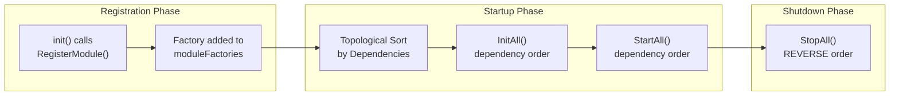
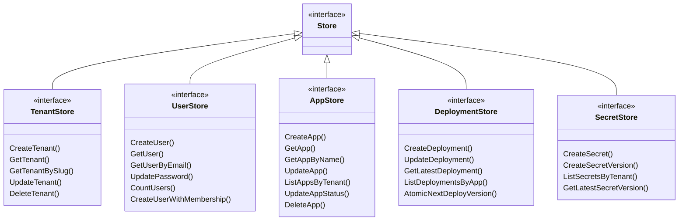
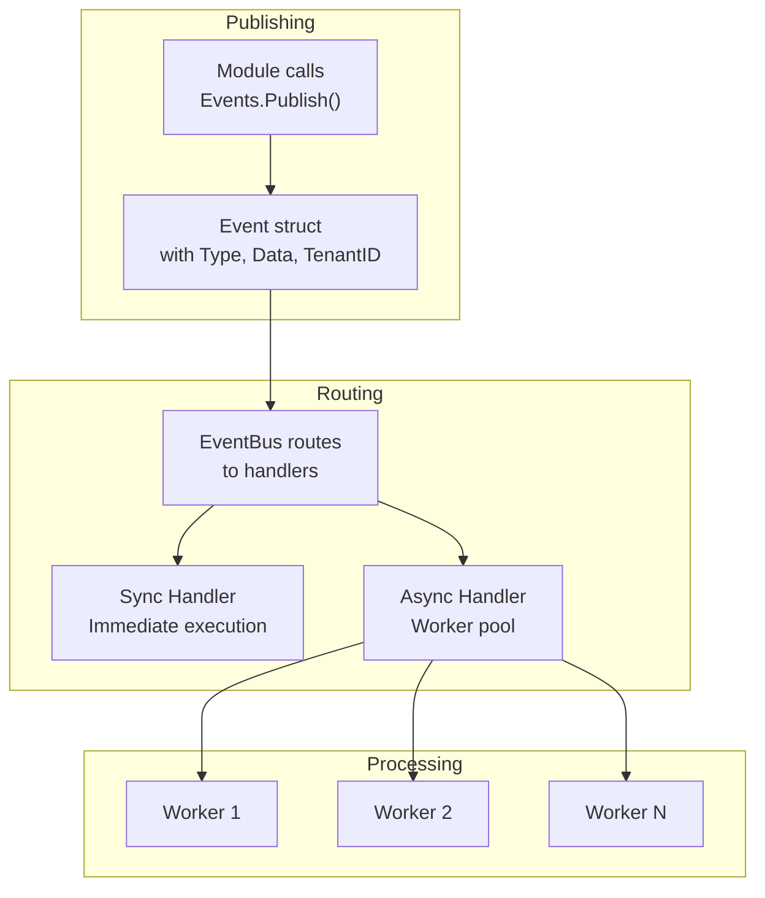
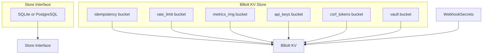
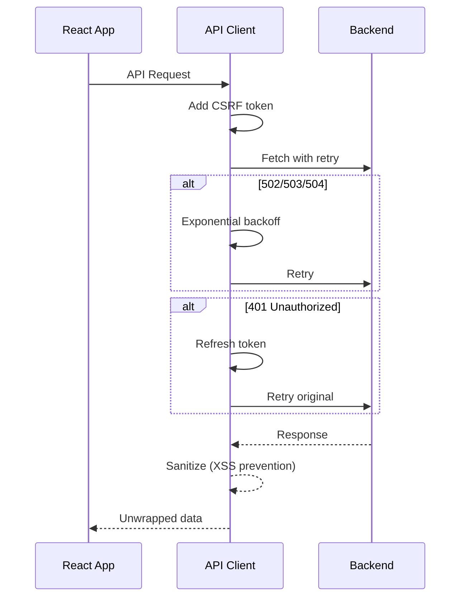
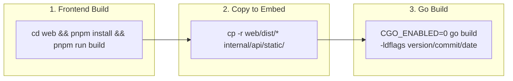
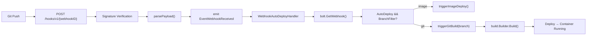
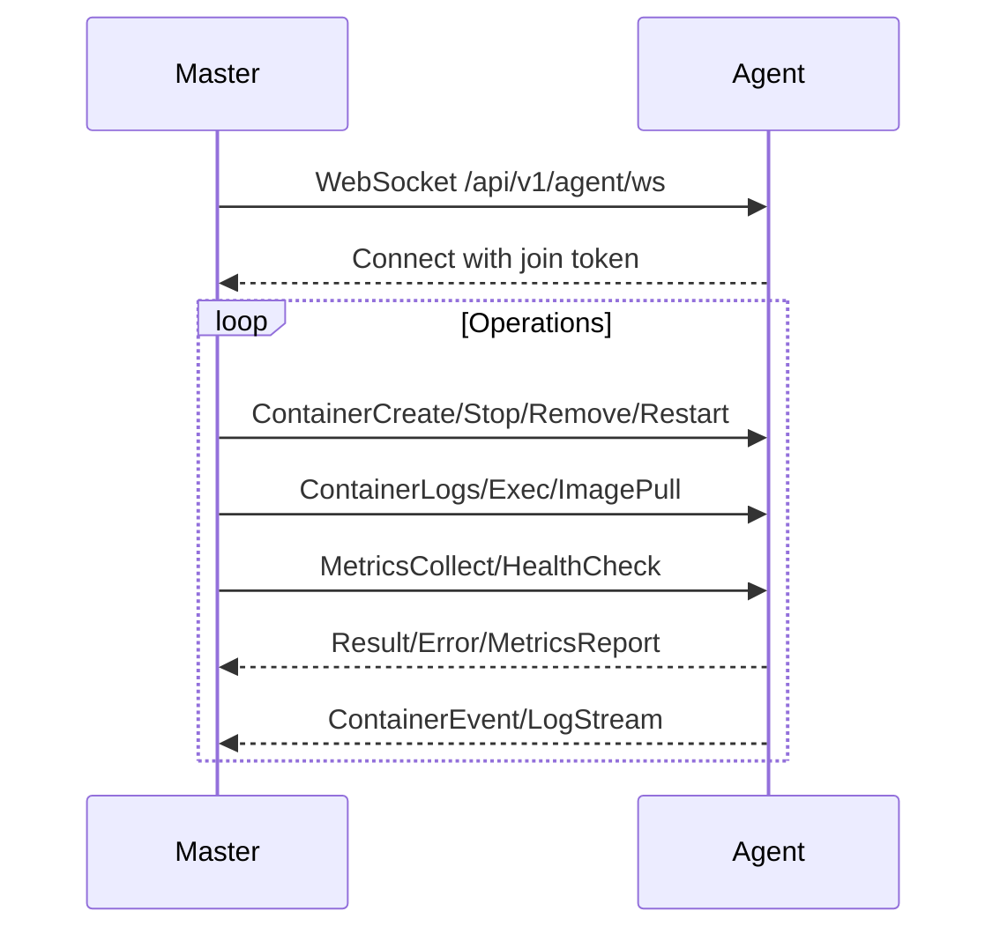
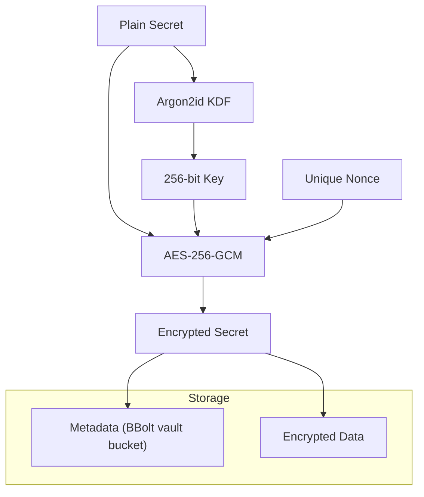
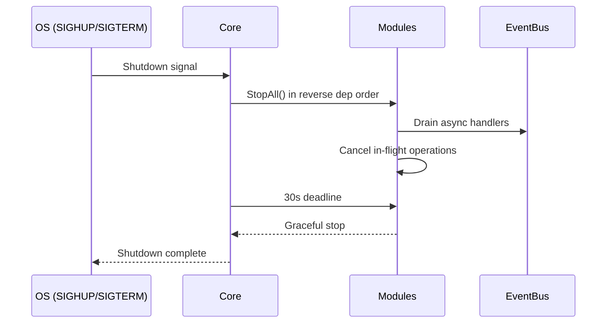

# DeployMonster Architecture

> A Go 1.26+ modular monolith PaaS with embedded React 19 frontend. Single binary, master or agent mode.

---

## Table of Contents

1. [Overview](#1-overview)
2. [High-Level Architecture](#2-high-level-architecture)
3. [Module System](#3-module-system)
4. [Core Structure](#4-core-structure)
5. [Store & Data Access](#5-store--data-access)
6. [Event System](#6-event-system)
7. [API Layer](#7-api-layer)
8. [Database Architecture](#8-database-architecture)
9. [Configuration](#9-configuration)
10. [Frontend Architecture](#10-frontend-architecture)
11. [Build Pipeline](#11-build-pipeline)
12. [Master/Agent Mode](#12-masteragent-mode)
13. [Security](#13-security)
14. [Key Patterns](#14-key-patterns)

---

## 1. Overview

DeployMonster transforms any VPS with Docker into a multi-tenant deployment platform.

```
~24 MB single binary with embedded React UI
~188K LOC total (~50K Go source, ~117K Go tests, ~22K React/TS/CSS)
20 auto-registered modules
251 REST API routes
85%+ coverage gate
```

### Tech Stack

| Layer | Technology |
|-------|------------|
| Language | Go 1.26+ |
| Frontend | React 19, TypeScript, Vite, Tailwind v4, shadcn/ui, Zustand |
| Database | SQLite (default), PostgreSQL (enterprise), BBolt KV |
| Container | Docker SDK |
| Reverse Proxy | Custom (net/http/httputil) | Label-based routing, built-in ACME |
| Authentication | JWT (HS256), API Keys |

---

## 2. High-Level Architecture

```
┌──────────────────────────────────────────────────────────────────┐
│                       DeployMonster Binary                        │
├─────────────┬─────────────┬─────────────┬───────────┬────────────┤
│  Web UI     │  REST API   │  WebSocket  │  MCP      │  Webhooks  │
│  (React SPA)│  /api/v1/*  │  /ws/*      │  /mcp/*   │  /hooks/*  │
├─────────────┴─────────────┴─────────────┴───────────┴────────────┤
│                         Core Engine                               │
├──────┬──────┬──────┬──────┬──────┬──────┬──────┬────────┬────────┤
│Ingress│Deploy│Build │Disco-│Load  │DNS   │Resource│Backup │Market-│
│Gate  │Engine│Engine│very  │Bal.  │Sync  │Monitor │Engine │place  │
├──────┴──────┴──────┴──────┴──────┴──────┴──────┴────────┴────────┤
│                        Module System                              │
├──────────────────────────────────┬────────────────────────────────┤
│  Docker SDK ←→ Docker Engine     │  VPS Providers (SSH + API)     │
│  Local / Swarm / Compose         │  Hetzner│DO│Vultr│Linode│AWS   │
├──────────────────────────────────┴────────────────────────────────┤
│          Embedded DB (SQLite/BBolt) + Event Bus                   │
└───────────────────────────────────────────────────────────────────┘
```

### Architecture Decisions

| Decision | Choice | Rationale |
|----------|--------|-----------|
| Language | Go 1.26+ | Single binary, native concurrency, Docker SDK |
| Database | SQLite (CGo) + BBolt (pure Go) | SQLite for relational, BBolt for KV/sessions |
| Web UI | React 19 + Vite + Tailwind v4 + shadcn/ui | Embedded in binary via `embed.FS` |
| API | REST + WebSocket | REST for CRUD, WS for real-time logs/events |
| Auth | JWT + API Keys | Stateless, multi-tenant |
| Container Runtime | Docker SDK (moby/moby) | Direct Docker API, no shelling out |
| Orchestration | Docker Swarm Mode | Built-in, no K8s complexity |
| SSL | Let's Encrypt (ACME) via lego library | Auto-cert with HTTP-01 / DNS-01 challenge |
| Ingress | Custom reverse proxy (net/http/httputil) | Label-based routing, no Traefik dependency |
| DNS | Cloudflare API + Generic RFC2136 | Most common provider + standard fallback |

---

## 3. Module System

### 3.1 Module Interface

Every subsystem implements the `Module` interface in `internal/core/module.go`:

```go
type Module interface {
    ID() string              // Unique module ID (e.g., "core.db", "deploy")
    Name() string           // Human-readable name
    Version() string        // Semantic version
    Dependencies() []string // Module IDs this depends on

    Init(ctx context.Context, core *Core) error // Initialize
    Start(ctx context.Context) error             // Begin operations
    Stop(ctx context.Context) error              // Graceful shutdown

    Health() HealthStatus   // OK, Degraded, Down
    Routes() []Route        // HTTP endpoints
    Events() []EventHandler // Event subscriptions
}
```

### 3.2 Module Registration

Modules auto-register via `init()` using `core.RegisterModule()`:

```go
// In every module's module.go:
func init() {
    core.RegisterModule(func() core.Module { return New() })
}

// main.go imports all modules as blank imports (side effect):
_ "github.com/deploymonster/deploy-monster/internal/api"
_ "github.com/deploymonster/deploy-monster/internal/auth"
_ "github.com/deploymonster/deploy-monster/internal/deploy"
// ... etc for all 20 modules
```

### 3.3 Lifecycle



1. **Register** - All `init()` functions populate `moduleFactories`
2. **Resolve** - Topological sort via `Registry.Resolve()` based on `Dependencies()`
3. **Init All** - `Registry.InitAll()` calls `Init(ctx, core)` in dependency order
4. **Start All** - `Registry.StartAll()` calls `Start(ctx)`
5. **Stop All** - `Registry.StopAll()` calls `Stop(ctx)` in **reverse** order

### 3.4 All Modules

| Module ID | Name | Dependencies | Purpose |
|-----------|------|-------------|---------|
| `core.db` | Database | — | SQLite/PostgreSQL + BBolt KV store |
| `core.auth` | Authentication | `core.db` | JWT, password hashing, sessions |
| `api` | REST API | `core.db`, `core.auth` | HTTP server, routes, middleware |
| `deploy` | Deploy Engine | `core.db` | Docker container management |
| `build` | Build Engine | `core.db`, `deploy` | Worker pool, Dockerfile generation |
| `ingress` | Ingress Gateway | `core.db`, `deploy` | Reverse proxy on :80/:443, ACME |
| `discovery` | Service Discovery | `deploy`, `ingress` | Docker events, route registration |
| `secrets` | Secret Vault | `core.db` | AES-256-GCM encryption |
| `notifications` | Notifications | `core.db` | Slack, Discord, Telegram, SMTP |
| `backup` | Backup Engine | `core.db` | Local/S3 storage, snapshots |
| `billing` | Billing Engine | `core.db` | Stripe, usage metering, plans |
| `marketplace` | Marketplace | `core.db`, `deploy` | Template registry, 91 templates |
| `dns.sync` | DNS Synchronizer | `core.db` | Cloudflare DNS sync |
| `vps` | VPS Provider | `core.db` | Multi-provider VPS provisioning |
| `gitsources` | Git Sources | `core.db` | GitHub/GitLab integration |
| `swarm` | Swarm Orchestrator | `deploy` | Multi-node Docker Swarm |
| `resource` | Resource Monitor | `core.db`, `deploy` | Metrics, alerting |
| `enterprise` | Enterprise | `core.db`, `billing` | White-label, reseller, GDPR |
| `mcp` | MCP Server | `core.db`, `deploy` | Model Context Protocol |
| `database` | Database Manager | `core.db`, `deploy` | Managed DB containers |

> **Note:** The `core.events` (EventBus), `core.scheduler` (Task Scheduler), and `core.ssh` (SSH Client) are built into `internal/core/` and are not separate loadable modules.

---

## 4. Core Structure

### 4.1 Core Struct

Located in `internal/core/app.go`, `Core` is the dependency injection container:

```go
type Core struct {
    Config     *Config    // Application config
    ConfigPath string     // Hot-reload path
    Build      BuildInfo  // Version/commit/date from ldflags
    Registry   *Registry  // Module registry
    Events     *EventBus  // Central event system
    Scheduler  *Scheduler // Cron-like scheduler
    DB         *Database // SQLite + BBolt wrappers
    Store      Store     // Unified data access
    Services   *Services  // Service provider registry (Container, Secrets, Notifications, DNS, Backup, VPS, Git)
    Logger     *slog.Logger
    draining   atomic.Bool // Graceful shutdown
}
```

### 4.2 Services Registry

Modules communicate via service interfaces, not direct imports:

```go
type Services struct {
    Container     ContainerRuntime     // Docker operations
    SSH           SSHClient           // SSH execution
    Secrets       SecretResolver      // ${SECRET:name} resolution
    Notifications NotificationSender  // Multi-channel notifications

    dnsProviders     map[string]DNSProvider
    backupStorages   map[string]BackupStorage
    vpsProvisioners  map[string]VPSProvisioner
    gitProviders     map[string]GitProvider
}
```

Key service interfaces:

| Interface | Purpose | Key Methods |
|-----------|---------|-------------|
| `ContainerRuntime` | Docker operations | `CreateAndStart`, `Stop`, `Remove`, `Restart`, `Logs`, `Exec`, `Stats` |
| `SecretResolver` | Secret lookup | `Resolve(scope, name)`, `ResolveAll(scope, template)` |
| `NotificationSender` | Notifications | `Send(ctx, Notification)` |
| `DNSProvider` | DNS records | `Create`, `Update`, `Delete`, `Verify` |
| `BackupStorage` | Backup storage | `Upload`, `Download`, `Delete`, `List` |
| `VPSProvisioner` | VPS provisioning | `ListRegions`, `ListSizes`, `Create`, `Delete`, `Status` |
| `GitProvider` | Git platforms | `ListRepos`, `ListBranches`, `GetRepoInfo`, `CreateWebhook` |

---

## 5. Store & Data Access

**All data access goes through `Store`** — never concrete DB types.

```go
type Store interface {
    TenantStore
    UserStore
    AppStore
    DeploymentStore
    DomainStore
    ProjectStore
    RoleStore
    AuditStore
    SecretStore
    InviteStore
    UsageRecordStore
    BackupStore
    Close() error
    Ping(ctx context.Context) error
}
```

### Store Sub-Interfaces



### Database Implementations

| Implementation | File | Purpose |
|----------------|------|---------|
| SQLite | `internal/db/sqlite.go` | Default relational store |
| PostgreSQL | `internal/db/postgres.go` | Enterprise relational |
| BBolt | `internal/db/bolt.go` | KV store (rate limits, API keys, metrics) |

---

## 6. Event System

Located in `internal/core/events.go`, the event system enables loose coupling between modules.

### 6.1 Event Structure

```go
type Event struct {
    ID            string    // Unique ID for tracing
    Type          string    // Dot-namespaced (e.g., "app.deployed")
    Source        string    // Module ID
    Timestamp     time.Time
    TenantID      string    // Multi-tenant context
    UserID        string    // Actor
    CorrelationID string    // Request tracing
    Data          any       // Typed payload
}

type EventHandler struct {
    EventType string
    Name      string
    Handler   func(ctx context.Context, event Event) error
}
```

### 6.2 Event Matching

Events support pattern matching:

```go
// Exact match
"app.deployed"

// Prefix match (all app events)
"app.*"

// Wildcard match (all events)
"*"
```

### 6.3 Event Flow



### 6.4 Key Event Types

```go
// Application lifecycle
EventAppCreated, EventAppUpdated, EventAppDeployed, EventAppStopped
EventAppStarted, EventAppDeleted, EventAppCrashed, EventAppScaled

// Build pipeline
EventBuildStarted, EventBuildCompleted, EventBuildFailed

// Container
EventContainerStarted, EventContainerStopped, EventContainerDied

// Deployment
EventDeployFinished, EventDeployFailed, EventRollbackDone

// Webhook (inbound)
EventWebhookReceived  // Payload: WebhookEventData {WebhookID, Provider, EventType, Branch, CommitSHA, RepoURL}

// Webhook (outbound)
EventOutboundSent, EventOutboundFailed

// Billing
EventInvoiceGenerated, EventPaymentReceived, EventPaymentFailed

// System
EventSystemStarted, EventSystemStopping, EventConfigReloaded
```

---

## 7. API Layer

### 7.1 Middleware Chain

The actual middleware chain (in `internal/api/router.go:Handler()`):


> **Actual order vs. documented:** The middleware chain applies in the order shown above. The `globalRL` applies per-IP rate limiting only to `/api/*` and `/hooks/*` prefixes (not to static assets) to prevent browser sessions from exhausting the limit.

### 7.2 Authentication Levels

```go
const (
    AuthNone       AuthLevel = iota  // Public endpoints
    AuthAPIKey                       // X-API-Key header
    AuthJWT                          // Bearer token or dm_access cookie
    AuthAdmin                        // Admin role required
    AuthSuperAdmin                   // Super admin role required
)
```

### 7.3 Key Route Groups

| Group | Example Endpoints |
|-------|-------------------|
| Auth | `/api/v1/auth/login`, `/api/v1/auth/register`, `/api/v1/auth/refresh`, `/api/v1/auth/me` |
| Apps | `/api/v1/apps`, `/api/v1/apps/{id}`, `/api/v1/apps/{id}/deploy`, `/api/v1/apps/{id}/scale` |
| Deployments | `/api/v1/apps/{id}/deployments`, `/api/v1/apps/{id}/rollback` |
| Projects | `/api/v1/projects`, `/api/v1/projects/{id}/environment` |
| Databases | `/api/v1/databases/engines`, `/api/v1/databases` |
| Domains | `/api/v1/domains`, `/api/v1/certificates`, `/api/v1/domains/{id}/verify` |
| Servers | `/api/v1/servers/provision`, `/api/v1/servers/test-ssh` |
| Secrets | `/api/v1/secrets` |
| Billing | `/api/v1/billing/plans`, `/api/v1/billing/usage` |
| Marketplace | `/api/v1/marketplace`, `/api/v1/marketplace/deploy` |
| Webhooks | `/hooks/v1/{webhookID}`, `/api/v1/apps/{id}/webhooks`, `/api/v1/apps/{id}/webhooks/{webhookId}`, `/api/v1/webhooks/outbound` |
| MCP | `/mcp/v1/tools`, `/mcp/v1/tools/{name}` |
| Streaming | `/api/v1/apps/{id}/logs/stream` (SSE), `/api/v1/events/stream` |
| Admin | `/api/v1/admin/*` (RequireSuperAdmin) |

### 7.4 SPA Fallback

All non-API routes serve the embedded React SPA:

```go
r.mux.Handle("/", newSPAHandler())  // Serves embedded React UI
```

---

## 8. Database Architecture

### 8.1 Dual-Store Design



### 8.2 BBolt Buckets

| Bucket | Purpose |
|--------|---------|
| `idempotency` | Request deduplication keys |
| `rate_limit` | Per-IP/tenant rate limit counters |
| `metrics_ring` | Time-series container metrics |
| `api_keys` | API key hashes + metadata |
| `csrf_tokens` | CSRF token validation |
| `vault` | Per-deployment Argon2id salt |
| `webhooks` | Webhook records (AppID, AutoDeploy, BranchFilter, secret hash) |

### 8.3 Database Module Lifecycle

```go
type Module struct {
    sqlite   *SQLiteDB    // Relational data
    postgres *PostgresDB  // Enterprise relational
    bolt     *BoltStore   // KV store
    driver   string       // "sqlite" or "postgres"
}
```

---

## 9. Configuration

### 9.1 Config Sources (Priority)

```
1. monster.yaml file
2. MONSTER_* environment variable overrides
```

### 9.2 Config Structure

```yaml
server:
  host: 0.0.0.0
  port: 8443
  domain: ""                    # Platform domain
  secret_key: ""                # Auto-generated, JWT encryption
  cors_origins: ""              # Derived from domain if empty
  rate_limit_per_minute: 120

database:
  driver: sqlite                 # or postgres
  path: deploymonster.db
  url: ""                        # PostgreSQL connection string

ingress:
  http_port: 80
  https_port: 443
  enable_https: true
  force_https: true

acme:
  email: ""
  staging: false
  provider: http-01              # or dns-01

docker:
  host: unix:///var/run/docker.sock
  default_cpu_quota: 100000
  default_memory_mb: 512

backup:
  schedule: "02:00"
  retention_days: 30
  storage_path: /var/lib/deploymonster/backups
  encryption: true
  s3:
    bucket: ""
    region: ""

notifications:
  smtp:
    host: ""
    port: 587
    use_tls: true
  slack_webhook: ""
  discord_webhook: ""
  telegram_token: ""

registration:
  mode: open                     # open, invite_only, approval, disabled

limits:
  max_apps_per_tenant: 100
  max_build_minutes: 30
  max_concurrent_builds: 5
  max_concurrent_builds_per_tenant: 2

billing:
  enabled: false
  stripe_secret_key: ""
  stripe_webhook_key: ""
```

### 9.3 Hot Reload

SIGHUP triggers `Core.ReloadConfig()` which updates:
- Log level and format
- CORS origins
- Registration mode
- Backup schedule
- Resource limits

---

## 10. Frontend Architecture

### 10.1 Tech Stack

| Category | Technology |
|----------|------------|
| Framework | React 19 |
| Language | TypeScript |
| Build Tool | Vite |
| Styling | Tailwind CSS + shadcn/ui |
| State Management | Zustand |
| Routing | React Router v7 |
| Data Fetching | Custom API client |

### 10.2 Directory Structure

```
web/src/
├── App.tsx              # Root component, routing, auth gate
├── api/
│   └── client.ts        # Fetch wrapper with retry, refresh, CSRF
├── stores/
│   ├── auth.ts          # Zustand auth state
│   ├── theme.ts         # Theme preferences
│   ├── toastStore.ts    # Toast notifications
│   └── topologyStore.ts # Topology editor state
├── hooks/
│   ├── useApi.ts        # API call hook
│   └── index.ts         # Shared hooks
├── components/          # Reusable components
├── pages/                # Page components
└── lib/                  # Utilities
```

### 10.3 API Client Features



Key features:
- 30s default timeout, 10s for refresh
- Exponential backoff with jitter
- CSRF token injection for mutations
- JWT refresh with coalescing (single in-flight refresh)
- Error sanitization

### 10.4 Pages

```
/login, /register, /onboarding       # Public
/dashboard                           # Overview
/apps, /apps/:id, /apps/:id/deploy   # App management
/domains, /certificates              # Domain management
/databases                           # Managed databases
/servers                             # VPS provisioning
/git-sources                         # Git integration
/marketplace, /marketplace/:id       # Template marketplace
/team, /billing, /backups, /secrets  # Tenant management
/monitoring, /topology               # Observability
/admin                               # Admin panel
/settings                            # User settings
```

---

## 11. Build Pipeline

### 11.1 Build Flow



### 11.2 Build Script (`scripts/build.sh`)

```bash
#!/bin/bash
set -e

# 1. Build React UI
cd web && pnpm install --frozen-lockfile && pnpm run build

# 2. Copy to embed directory
rm -rf internal/api/static/*
cp -r web/dist/* internal/api/static/

# 3. Build Go binary
CGO_ENABLED=0 go build \
    -ldflags "-X main.version=$VERSION -X main.commit=$COMMIT -X main.date=$DATE" \
    -o bin/deploymonster
```

### 11.3 Embedded Static Files

The React UI is embedded via Go's `embed.FS`:

```go
//go:embed all:static
var staticFS embed.FS  // contains /index.html, /assets/, /chunks/, etc.

// In spa.go — newSPAHandler() serves from the embedded filesystem
sub, _ := fs.Sub(staticFS, "static")
fileServer := http.FileServer(http.FS(sub))
// Falls back to index.html for client-side routing (/apps, /admin, etc.)
```

### 11.4 Webhook Auto-Deploy Flow

Webhook-triggered automatic deployment bridges git events to the build pipeline:



**Components:**
- `internal/webhooks/receiver.go` — Inbound webhook endpoint, signature verification, payload parsing
- `internal/api/handlers/webhook_auto_deploy.go` — Subscribes to `EventWebhookReceived`, triggers builds/deploys
- `internal/api/handlers/webhook_crud.go` — Webhook CRUD API (Create, List, Get, Update, Delete)
- `internal/db/bolt.go` — `GetWebhook()` and `GetWebhookSecret()` for BBolt webhook storage

**Branch Filter Patterns:**
- Exact: `main`, `develop`
- Glob prefix: `feature/*`, `release-*`
- Multi-pattern: `main,develop,feature/*`

---

## 12. Master/Agent Mode

Same binary runs as master (control plane) or agent (worker node) via the `serve` command:

```bash
# Master (default)
deploymonster serve

# Agent (worker) — joins cluster via WebSocket
deploymonster serve --agent --master=host:8443 --token=<join-token>
```

The agent mode connects to the master's WebSocket endpoint at `/api/v1/agent/ws` and authenticates with a join token. No UI or API runs on agent nodes — only container operations dispatched from the master.

### 12.1 Agent Protocol



### 12.2 Message Types

**Master → Agent:**
```go
AgentMsgPing, AgentMsgContainerCreate, AgentMsgContainerStop,
AgentMsgContainerRemove, AgentMsgContainerRestart, AgentMsgContainerList,
AgentMsgContainerLogs, AgentMsgContainerExec, AgentMsgImagePull,
AgentMsgNetworkCreate, AgentMsgVolumeCreate, AgentMsgMetricsCollect,
AgentMsgHealthCheck, AgentMsgConfigUpdate
```

**Agent → Master:**
```go
AgentMsgPong, AgentMsgResult, AgentMsgError,
AgentMsgMetricsReport, AgentMsgContainerEvent,
AgentMsgServerStatus, AgentMsgLogStream
```

---

## 13. Security

### 13.1 Authentication & Authorization

| Mechanism | Details |
|-----------|---------|
| JWT | HS256, access=15min, refresh=7days |
| API Keys | bcrypt hash verification |
| Passwords | bcrypt cost 13 |
| Webhook Verification | HMAC signature |
| CSRF Protection | Double-submit cookie |

### 13.2 Secrets Encryption



### 13.3 Rate Limiting

- Per-IP global limit (default: 120/min)
- Per-tenant limits
- Per-endpoint limits
- BBolt-backed counters

### 13.4 Input Validation

- Request body size limit (10MB)
- Request timeout (30s)
- CSRF token validation
- XSS sanitization on error messages

---

## 14. Key Patterns

### 14.1 Dependency Injection

No global state — all dependencies injected via `Core`:

```go
func (m *Module) Init(ctx context.Context, c *core.Core) error {
    m.core = c
    m.store = c.Store
    m.events = c.Events
    return nil
}
```

### 14.2 Service Lookup

Interface-based lookup without imports:

```go
container := m.core.Services.Container
// Instead of direct import: deploymodule.NewDockerClient()
```

### 14.3 Module Communication

Modules communicate via:
1. **Direct method calls** — through service interfaces
2. **Events** — for loose coupling and async operations

### 14.4 Graceful Shutdown



### 14.5 Idempotency

Mutating requests include `Idempotency-Key` header:

```go
// Stored in BBolt idempotency bucket
// Prevents duplicate operations on retry
```

### 14.6 Test Patterns

| Pattern | Description |
|---------|-------------|
| Mock interfaces | Optional function fields + call tracking |
| Table-driven tests | `t.Run` subtests |
| Integration tests | Gated with `//go:build integration` tags |
| Contract tests | Shared logic in `store_contract_test.go` |
| Fuzzing | `go test -fuzz` for parsers |

---

## 15. Key Source Files

For accurate line counts, run:
```bash
find internal web/src -name "*.go" -o -name "*.ts" -o -name "*.tsx" | xargs wc -l
```

Key source files (see actual file for current line counts):

| Path | Purpose |
|------|---------|
| `cmd/deploymonster/main.go` | Entry point, CLI commands, serve + agent mode |
| `internal/core/module.go` | Module interface definition |
| `internal/core/app.go` | Core struct, Run lifecycle, RegisterModule |
| `internal/core/registry.go` | Module registration, topological sort |
| `internal/core/store.go` | Store interface + all data models |
| `internal/core/events.go` | EventBus with sync/async handlers, WebhookEventData |
| `internal/core/interfaces.go` | Service interfaces (ContainerRuntime, BoltStorer with GetWebhook) |
| `internal/core/config.go` | Config struct + MONSTER_* env overrides |
| `internal/core/scheduler.go` | Cron-like task scheduler |
| `internal/api/router.go` | HTTP route registration, middleware chain, webhook handlers |
| `internal/api/module.go` | API module lifecycle |
| `internal/api/middleware/middleware.go` | Auth, CORS, Recovery, RequestLogger |
| `internal/api/middleware/*.go` | Rate limiting, metrics, CSRF, idempotency, audit |
| `internal/api/handlers/webhook_auto_deploy.go` | Webhook auto-deploy event handler |
| `internal/api/handlers/webhook_crud.go` | Webhook CRUD API |
| `internal/db/module.go` | SQLite/Postgres/BBolt initialization |
| `internal/db/bolt.go` | BBolt KV store, GetWebhook, GetWebhookSecret |
| `internal/webhooks/receiver.go` | Inbound webhook endpoint + signature verification |
| `internal/deploy/module.go` | Docker container management |
| `internal/secrets/module.go` | AES-256-GCM encrypted vault |
| `internal/ingress/module.go` | Reverse proxy + ACME certificate management |
| `internal/notifications/module.go` | Multi-channel notifications |
| `internal/swarm/module.go` | Swarm Orchestrator (master/agent WebSocket) |
| `web/src/App.tsx` | React routing + auth gate |
| `web/src/api/client.ts` | Fetch wrapper with JWT refresh, CSRF, retry |

---

## 16. Getting Started

### Development

```bash
# Clone and setup
git clone https://github.com/deploymonster/deploy-monster
cd deploy-monster

# Install git hooks
./scripts/setup-git-hooks.sh

# Build and run (full pipeline: React build → embed → Go build)
./scripts/build.sh && ./bin/deploymonster serve

# Or run in development mode (no embedded UI)
go run ./cmd/deploymonster serve

# Run tests
make test           # All tests with race detector + coverage
make test-short     # Skip integration tests
make lint           # golangci-lint
```

### Docker

```bash
# Build Docker image
docker build -t deploymonster .

# Run container
docker run -p 8443:8443 \
  -v /var/run/docker.sock:/var/run/docker.sock \
  -v $(pwd)/data:/data \
  deploymonster serve
```
